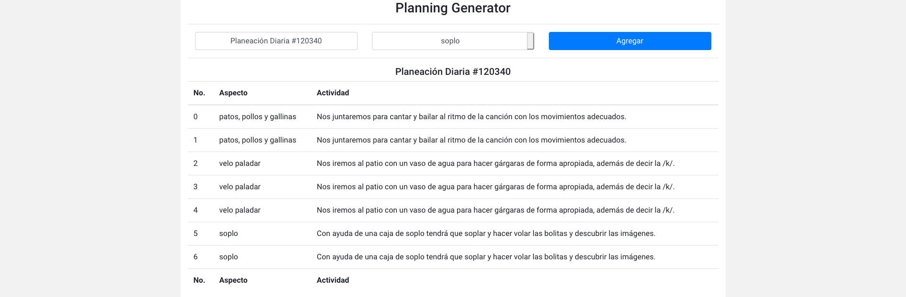

# PLANNING GENERATOR
#### Planning generator for to do easy life in special education work

### Requeriments
- NodeJS

### Installation
```bash
git clone https://github.com/eduardobc88/planning-generator.git
cd planning-generator
npm install
npm run pm2:start-watch
```

### Screen:


### Development by:
- E-mail: eduardobc.88@gmail.com
- Name: Eduardo Beltran Carbajal
